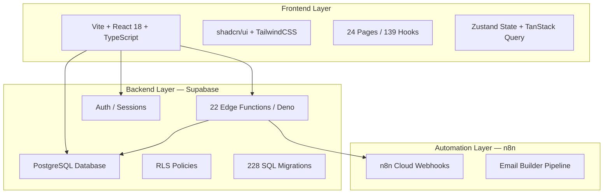

# LightCRM — Initial System Overview Report

**Audit Date:** 2026-03-07  
**Audit Scope:** Full production-readiness assessment for migration out of Lovable  
**System:** LightCRM (Sourcing Greatness CRM)  
**Repository:** [lightcrm-dash-flow](file:///d:/AntiGravity/Sourcing%20Greatness/lightcrm-dash-flow)

---

## 1. System Architecture Summary



### Layer 1: Frontend Application
| Attribute | Value |
|-----------|-------|
| Framework | Vite 5.4 + React 18.3 + TypeScript 5.8 |
| UI Library | shadcn/ui + Radix primitives |
| Styling | TailwindCSS 3.4 |
| State | Zustand 5.0 + TanStack Query 5 |
| Routing | React Router DOM 6.30 |
| Pages | 24 page-level components |
| Hooks | 139 custom hooks |
| Auth | Supabase Auth via [AuthContext](file:///d:/AntiGravity/Sourcing%20Greatness/lightcrm-dash-flow/src/contexts/AuthContext.tsx#5-11) + [ProtectedRoute](file:///d:/AntiGravity/Sourcing%20Greatness/lightcrm-dash-flow/src/components/auth/ProtectedRoute.tsx#11-33) |

### Layer 2: Supabase Backend
| Attribute | Value |
|-----------|-------|
| Project ID | `wjghdqkxwuyptxzdidtf` |
| Edge Functions | 22 (16 with JWT, 6 without) |
| SQL Migrations | 228 files (Sept 2025 → Feb 2026) |
| Auth Model | Supabase Auth with `user_roles` table |
| RLS | Enabled on core tables, `auth.role() = 'authenticated'` pattern |
| DB Functions | `SECURITY DEFINER` with `SET search_path = public` |

### Layer 3: n8n Automation
| Attribute | Value |
|-----------|-------|
| Instance | `inverisllc.app.n8n.cloud` |
| Integration | Via `post_to_n8n` and `post_to_n8n_2026` edge functions |
| Webhook | `https://inverisllc.app.n8n.cloud/webhook/Email-Builder` |
| Purpose | Email draft generation pipeline |

---

## 2. Audit Findings

### FINDING-01: [.env](file:///d:/AntiGravity/Sourcing%20Greatness/lightcrm-dash-flow/.env) File Committed to Git Repository

> [!CAUTION]
> **Risk Level: CRITICAL**

**Diagnosis:** The [.env](file:///d:/AntiGravity/Sourcing%20Greatness/lightcrm-dash-flow/.env) file containing Supabase credentials is tracked in Git. The [.gitignore](file:///d:/AntiGravity/Sourcing%20Greatness/lightcrm-dash-flow/.gitignore) does not include [.env](file:///d:/AntiGravity/Sourcing%20Greatness/lightcrm-dash-flow/.env).

**Evidence:**
- [.env](file:///d:/AntiGravity/Sourcing%20Greatness/lightcrm-dash-flow/.env) contains `VITE_SUPABASE_PROJECT_ID`, `VITE_SUPABASE_PUBLISHABLE_KEY`, `VITE_SUPABASE_URL`
- [.env](file:///d:/AntiGravity/Sourcing%20Greatness/lightcrm-dash-flow/.env) is not in [.gitignore](file:///d:/AntiGravity/Sourcing%20Greatness/lightcrm-dash-flow/.gitignore)

**Recommended Fix:**
1. Add [.env](file:///d:/AntiGravity/Sourcing%20Greatness/lightcrm-dash-flow/.env) and `.env.*` to [.gitignore](file:///d:/AntiGravity/Sourcing%20Greatness/lightcrm-dash-flow/.gitignore)
2. Remove [.env](file:///d:/AntiGravity/Sourcing%20Greatness/lightcrm-dash-flow/.env) from Git tracking: `git rm --cached .env`
3. Rotate the Supabase anon key if the repo has ever been public
4. Create `.env.example` with placeholder values

**Validation:** Verify [.env](file:///d:/AntiGravity/Sourcing%20Greatness/lightcrm-dash-flow/.env) no longer appears in `git status` and future commits.

**Migration Impact:** All deployment environments must have [.env](file:///d:/AntiGravity/Sourcing%20Greatness/lightcrm-dash-flow/.env) provisioned externally (CI/CD secrets, hosting env vars).

---

### FINDING-02: Supabase Credentials Hardcoded in Source Code

> [!CAUTION]
> **Risk Level: CRITICAL**

**Diagnosis:** The Supabase client at [client.ts](file:///d:/AntiGravity/Sourcing%20Greatness/lightcrm-dash-flow/src/integrations/supabase/client.ts) hardcodes the Supabase URL and anon key directly in source, ignoring the [.env](file:///d:/AntiGravity/Sourcing%20Greatness/lightcrm-dash-flow/.env) variables.

**Evidence:**
```typescript
// client.ts lines 5-6
const SUPABASE_URL = "https://wjghdqkxwuyptxzdidtf.supabase.co";
const SUPABASE_PUBLISHABLE_KEY = "eyJhbGciOiJ...";
```

**Recommended Fix:**
```typescript
const SUPABASE_URL = import.meta.env.VITE_SUPABASE_URL;
const SUPABASE_PUBLISHABLE_KEY = import.meta.env.VITE_SUPABASE_PUBLISHABLE_KEY;
```

**Validation:** Application loads correctly after change; verify env vars are read at build time.

**Migration Impact:** Critical for multi-environment deployment (dev/staging/production).

---

### FINDING-03: Edge Functions with JWT Verification Disabled

> [!WARNING]
> **Risk Level: HIGH**

**Diagnosis:** Six edge functions have `verify_jwt = false` in [config.toml](file:///d:/AntiGravity/Sourcing%20Greatness/lightcrm-dash-flow/supabase/config.toml). These are AI integration endpoints called by n8n.

**Evidence:**
```toml
[functions.ai_add_opportunity_next_step]
verify_jwt = false

[functions.ai_create_or_update_opportunity]
verify_jwt = false

[functions.ai_add_contact_next_step]
verify_jwt = false

[functions.ai_create_or_update_contact]
verify_jwt = false

[functions.ai_add_contact_note]
verify_jwt = false

[functions.ai_add_opportunity_note]
verify_jwt = false
```

**Mitigating Factor:** These functions use a custom `x-edge-api-key` header check via [requireApiKey()](file:///d:/AntiGravity/Sourcing%20Greatness/lightcrm-dash-flow/supabase/functions/_shared/edgeUtils.ts#46-70) in [edgeUtils.ts](file:///d:/AntiGravity/Sourcing%20Greatness/lightcrm-dash-flow/supabase/functions/_shared/edgeUtils.ts). However, this relies on the `EDGE_FUNCTION_API_KEY` environment variable being set correctly.

**Recommended Fix:**
1. Verify `EDGE_FUNCTION_API_KEY` is configured in Supabase project secrets
2. Ensure the API key is sufficiently strong (minimum 32 characters, cryptographically random)
3. Document these endpoints as machine-to-machine only
4. Consider rate limiting on these endpoints

**Migration Impact:** `EDGE_FUNCTION_API_KEY` must be provisioned in the new environment. n8n workflows must be configured with the correct key.

---

### FINDING-04: Hardcoded n8n Webhook URL

> [!WARNING]
> **Risk Level: HIGH**

**Diagnosis:** The n8n webhook URL is hardcoded directly in the [post_to_n8n edge function](file:///d:/AntiGravity/Sourcing%20Greatness/lightcrm-dash-flow/supabase/functions/post_to_n8n/index.ts#L30).

**Evidence:**
```typescript
const N8N_WEBHOOK_URL = 'https://inverisllc.app.n8n.cloud/webhook/Email-Builder';
```

**Recommended Fix:**
```typescript
const N8N_WEBHOOK_URL = Deno.env.get('N8N_WEBHOOK_URL');
if (!N8N_WEBHOOK_URL) {
  throw new Error('N8N_WEBHOOK_URL not configured');
}
```

**Validation:** Set `N8N_WEBHOOK_URL` as a Supabase project secret; verify email builder flow works.

**Migration Impact:** Environment separation between dev/staging/production n8n instances becomes possible.

---

### FINDING-05: Wildcard CORS Policy (`Access-Control-Allow-Origin: *`)

> [!WARNING]
> **Risk Level: HIGH**

**Diagnosis:** All edge functions use `Access-Control-Allow-Origin: *` in their CORS headers. This allows any website to make API calls to these functions.

**Evidence:** [edgeUtils.ts L8-11](file:///d:/AntiGravity/Sourcing%20Greatness/lightcrm-dash-flow/supabase/functions/_shared/edgeUtils.ts#L8-L11) and [post_to_n8n L4-7](file:///d:/AntiGravity/Sourcing%20Greatness/lightcrm-dash-flow/supabase/functions/post_to_n8n/index.ts#L4-L7).

**Recommended Fix:** Restrict CORS to the application's domain(s):
```typescript
const ALLOWED_ORIGINS = (Deno.env.get('ALLOWED_ORIGINS') || '').split(',');
```

**Migration Impact:** Must configure allowed origins per environment.

---

### FINDING-06: Zero Test Coverage

> [!WARNING]
> **Risk Level: HIGH**

**Diagnosis:** The project has **zero test files**. No `.test.ts`, `.test.tsx`, `.spec.ts`, or `.spec.tsx` files exist anywhere in the repository. No testing framework (Jest, Vitest, Playwright, etc.) is configured.

**Evidence:** File search for `*.test.*` and `*.spec.*` returned 0 results.

**Recommended Fix:**
1. Add Vitest as a testing framework (natural fit with Vite)
2. Prioritize tests for: auth flows, data mutation hooks, edge function logic
3. Add Playwright for critical user flow E2E tests

**Migration Impact:** Without tests, migration introduces high regression risk. Any code changes cannot be validated automatically.

---

### FINDING-07: Lovable Platform Dependencies Still Present

> [!IMPORTANT]
> **Risk Level: MEDIUM**

**Diagnosis:** Several Lovable-specific artifacts remain in the codebase:

**Evidence:**
- [vite.config.ts](file:///d:/AntiGravity/Sourcing%20Greatness/lightcrm-dash-flow/vite.config.ts) imports `lovable-tagger` (line 4)
- [package.json](file:///d:/AntiGravity/Sourcing%20Greatness/lightcrm-dash-flow/package.json) lists `lovable-tagger: ^1.1.9` in devDependencies (line 97)
- [README.md](file:///d:/AntiGravity/Sourcing%20Greatness/lightcrm-dash-flow/README.md) references Lovable deployment exclusively
- [client.ts](file:///d:/AntiGravity/Sourcing%20Greatness/lightcrm-dash-flow/src/integrations/supabase/client.ts) header says "automatically generated. Do not edit."
- `.lovable` directory exists in project root

**Recommended Fix:**
1. Remove `lovable-tagger` from devDependencies and vite config
2. Remove `.lovable` directory
3. Update README.md for independent deployment
4. Remove "auto-generated" comment from client.ts

**Migration Impact:** `lovable-tagger` may break builds if the Lovable registry becomes unavailable.

---

### FINDING-08: Edge Functions Use Service Role Key

> [!IMPORTANT]
> **Risk Level: MEDIUM**

**Diagnosis:** 12 edge functions create Supabase clients using `SUPABASE_SERVICE_ROLE_KEY`, which bypasses all RLS policies. While this is normal for server-side operations, it means these functions have unrestricted database access.

**Evidence:** `SUPABASE_SERVICE_ROLE_KEY` found in 12 edge function files. Key is correctly accessed via `Deno.env.get()` — **NOT exposed to the frontend** (confirmed).

**Recommended Fix:**
1. Audit each function to ensure it only accesses data it needs
2. Document which functions use service role and why
3. Consider using scoped permissions where possible

---

### FINDING-09: RLS Policies Allow Any Authenticated User Full Access

> [!IMPORTANT]
> **Risk Level: MEDIUM**

**Diagnosis:** RLS policies use `auth.role() = 'authenticated'` pattern, meaning any logged-in user can read/write all contacts, opportunities, and interactions. There is no per-user or per-organization data isolation.

**Evidence:** [Initial migration](file:///d:/AntiGravity/Sourcing%20Greatness/lightcrm-dash-flow/supabase/migrations/20250903120732_5f56003a-b2cd-4c43-ad6d-c6f7d3d03ef0.sql#L27-L34) confirms the pattern with comment: *"we'll allow any authenticated user to access all data"*.

**Recommended Fix:**
- Acceptable for small team CRM (all users see all data)
- Document this as a known design decision
- Flag for future if multi-tenancy is needed

**Migration Impact:** Low — this is a business logic decision, not a security bug for the current use case.

---

### FINDING-10: `SECURITY DEFINER` Functions Without Owner Restriction

> [!IMPORTANT]
> **Risk Level: MEDIUM**

**Diagnosis:** Database functions use `SECURITY DEFINER`, which means they execute with the permissions of the function owner (typically superuser). They do set `search_path = public` (good), but any authenticated user can invoke them via the API.

**Evidence:** Functions like `last_interaction_for_email`, `interactions_for_email_recent`, `opportunities_query`, `opportunities_aggregate` all use `SECURITY DEFINER`.

**Recommended Fix:** Review [SECURITY_DEFINER_DOCS.md](file:///d:/AntiGravity/Sourcing%20Greatness/lightcrm-dash-flow/SECURITY_DEFINER_DOCS.md) for existing documentation and validate each function's exposure surface.

---

### FINDING-11: Role Checking is Client-Side Only

> [!IMPORTANT]
> **Risk Level: MEDIUM**

**Diagnosis:** Admin role checking via [useUserRole.ts](file:///d:/AntiGravity/Sourcing%20Greatness/lightcrm-dash-flow/src/hooks/useUserRole.ts) queries `user_roles` table client-side. The [ProtectedRoute](file:///d:/AntiGravity/Sourcing%20Greatness/lightcrm-dash-flow/src/components/auth/ProtectedRoute.tsx#11-33) component prevents UI access but does **not** enforce server-side authorization. Any authenticated user can still call admin edge functions directly.

**Evidence:** Edge functions like `invite_user`, `delete_user`, `list_users` verify JWT but do not check user roles.

**Recommended Fix:**
1. Add role verification in admin-level edge functions
2. Create a shared `requireAdmin()` helper in [_shared/edgeUtils.ts](file:///d:/AntiGravity/Sourcing%20Greatness/lightcrm-dash-flow/supabase/functions/_shared/edgeUtils.ts)

---

### FINDING-12: EmailBuilder.tsx is 85KB — Monolithic Component

> [!NOTE]
> **Risk Level: LOW**

**Diagnosis:** [EmailBuilder.tsx](file:///d:/AntiGravity/Sourcing%20Greatness/lightcrm-dash-flow/src/pages/EmailBuilder.tsx) is 85,375 bytes — an extremely large single-file component. This is a maintainability concern typical of Lovable-generated code.

**Evidence:** File size: 85KB. Other large files include [TomNewView.tsx](file:///d:/AntiGravity/Sourcing%20Greatness/lightcrm-dash-flow/src/pages/TomNewView.tsx) (31KB), [LgHorizons.tsx](file:///d:/AntiGravity/Sourcing%20Greatness/lightcrm-dash-flow/src/pages/LgHorizons.tsx) (24KB), [useCsvImport.ts](file:///d:/AntiGravity/Sourcing%20Greatness/lightcrm-dash-flow/src/hooks/useCsvImport.ts) (46KB).

**Recommended Fix:** Refactor into smaller, composable components after migration stabilizes.

---

### FINDING-13: No CI/CD Pipeline

> [!NOTE]
> **Risk Level: LOW (becomes HIGH for migration)**

**Diagnosis:** No GitHub Actions, no deployment scripts, no Dockerfile, no CI/CD configuration exists. The project relies entirely on Lovable's deployment infrastructure.

**Recommended Fix:**
1. Create GitHub Actions workflow for: lint, type-check, build
2. Add deployment pipeline (Vercel/Netlify/Docker based on target)
3. Add Supabase migration check step

---

### FINDING-14: Multiple Lock Files (bun.lock + package-lock.json)

> [!NOTE]
> **Risk Level: LOW**

**Diagnosis:** Both [bun.lock](file:///d:/AntiGravity/Sourcing%20Greatness/lightcrm-dash-flow/bun.lock), [bun.lockb](file:///d:/AntiGravity/Sourcing%20Greatness/lightcrm-dash-flow/bun.lockb) and [package-lock.json](file:///d:/AntiGravity/Sourcing%20Greatness/lightcrm-dash-flow/package-lock.json) exist, indicating mixed package manager usage.

**Recommended Fix:** Standardize on one package manager. Add the other's lock file to [.gitignore](file:///d:/AntiGravity/Sourcing%20Greatness/lightcrm-dash-flow/.gitignore).

---

### FINDING-15: Debug Logging in Production Code

> [!NOTE]
> **Risk Level: LOW**

**Diagnosis:** The App component includes debug logging statements.

**Evidence:** [App.tsx L37-38](file:///d:/AntiGravity/Sourcing%20Greatness/lightcrm-dash-flow/src/App.tsx#L37-L38):
```typescript
logger.log('App component rendering...');
logger.log('React version check:', React?.version);
```

**Recommended Fix:** Review and configure logger for production (conditional logging via env var). A [logger.ts](file:///d:/AntiGravity/Sourcing%20Greatness/lightcrm-dash-flow/src/lib/logger.ts) utility exists — verify it respects environment.

---

## 3. Findings Summary

| # | Finding | Severity | Domain |
|---|---------|----------|--------|
| 01 | [.env](file:///d:/AntiGravity/Sourcing%20Greatness/lightcrm-dash-flow/.env) committed to Git | **CRITICAL** | Security |
| 02 | Supabase credentials hardcoded in source | **CRITICAL** | Security / Deployment |
| 03 | 6 edge functions with JWT disabled | **HIGH** | Security |
| 04 | Hardcoded n8n webhook URL | **HIGH** | Deployment / Migration |
| 05 | Wildcard CORS policy | **HIGH** | Security |
| 06 | Zero test coverage | **HIGH** | Reliability |
| 07 | Lovable platform dependencies | **MEDIUM** | Migration |
| 08 | Service role key usage in edge functions | **MEDIUM** | Security |
| 09 | RLS allows all authenticated users full access | **MEDIUM** | Security / Architecture |
| 10 | SECURITY DEFINER without role restriction | **MEDIUM** | Database |
| 11 | Role checking only client-side | **MEDIUM** | Security |
| 12 | 85KB monolithic EmailBuilder component | **LOW** | Maintainability |
| 13 | No CI/CD pipeline | **LOW → HIGH** | Deployment |
| 14 | Multiple lock files | **LOW** | Configuration |
| 15 | Debug logging in production | **LOW** | Observability |

---

## 4. Recommended Priority Order for Remediation

### P0 — Must fix before migration
1. **FINDING-01:** Add [.env](file:///d:/AntiGravity/Sourcing%20Greatness/lightcrm-dash-flow/.env) to [.gitignore](file:///d:/AntiGravity/Sourcing%20Greatness/lightcrm-dash-flow/.gitignore), remove from tracking
2. **FINDING-02:** Refactor [client.ts](file:///d:/AntiGravity/Sourcing%20Greatness/lightcrm-dash-flow/src/integrations/supabase/client.ts) to use `import.meta.env`
3. **FINDING-04:** Move n8n webhook URL to environment variable
4. **FINDING-07:** Remove Lovable dependencies

### P1 — Should fix before production
5. **FINDING-05:** Restrict CORS to application domain(s)
6. **FINDING-03:** Document + validate API key auth on JWT-disabled functions
7. **FINDING-11:** Add server-side role checking in admin functions
8. **FINDING-13:** Create basic CI/CD pipeline

### P2 — Address for long-term health
9. **FINDING-06:** Establish testing framework and initial test suite
10. **FINDING-09:** Document RLS design decision
11. **FINDING-10:** Audit SECURITY DEFINER function exposure
12. **FINDING-14:** Standardize package manager
13. **FINDING-15:** Configure production logging
14. **FINDING-12:** Refactor monolithic components

---

## 5. Next Steps

This Initial System Overview Report establishes the baseline understanding of the system. The following detailed audits are recommended:

1. **Security Deep-Dive** — Full RLS policy review, auth flow tracing, edge function authorization audit
2. **Supabase Database Audit** — Schema integrity, index review, constraint validation, migration hygiene
3. **n8n Automation Audit** — Workflow inspection, idempotency, retry logic, credential handling
4. **Deployment Readiness Audit** — Build validation, environment configuration, hosting requirements
5. **Migration Risk Assessment** — Lovable dependency removal plan, DNS/domain transition, rollback strategy
6. **Remediation Execution** — Branch-based fixes per GitHub synchronization rules

> [!IMPORTANT]
> **Preliminary Recommendation: NO-GO for production deployment in current state.**
> The two CRITICAL findings (FINDING-01, FINDING-02) must be resolved before any migration. The HIGH findings should be addressed for a safe production deployment.
